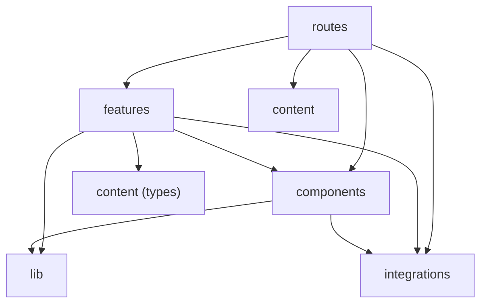

# Architecture

This is a portfolio site, not a framework. The layering below exists to keep one
thing true: a page is a list of sections, and you can change what a section says
without reading how it renders, or change how it renders without hunting for the
copy.

`src/architecture.test.ts` enforces every rule on this page. If you disagree with
one, change the matrix there — don't work around it.

## Layers

```
src/
  routes/        containers — pick the content, compose the sections
  features/      domain sections — presentational, take props, own no data
  components/
    layout/      page shells
    ui/          generic primitives, no domain knowledge
    text/        the scramble and typewriter effects
  content/       the site's copy and lists, typed
  lib/           pure helpers, no Solid, no DOM
  styles/        the design system, generates the CSS
  dev/           instrumentation, DEV-gated, never ships
  integrations/  one folder per third-party SDK
```

Imports run one way only:



Three rules carry most of the weight:

- **A feature never imports another feature.** Two sections that need the same
  thing means that thing belongs in `components/ui` or `lib`, not in a sideways
  import. Shared state between sections belongs in the route that renders both.
- **A component never imports a feature or content.** `components/ui` is where
  something goes once it stops knowing what it is being used for. A primitive
  that reaches for `~/content` has picked a side and belongs in `features`.
- **`lib` imports nothing.** If a helper needs Solid, it is a primitive and
  belongs beside the component that uses it.

`styles`, `dev` and `integrations` predate the layers and keep their own rules,
documented in their READMEs. The one addition: app code may import them, they may
not import app code.

## Where does this go?

| You are adding | It goes in |
|---|---|
| A new page | `routes/` — keep it to composition |
| A section of a page | `features/<slice>/` |
| Copy, a list of jobs, a set of links | `content/` |
| Something reusable that renders | `components/ui/` |
| Something reusable that computes | `lib/` |
| A wrapper around an npm package | `integrations/<vendor>/` |

## Content

`content/` is plain typed TypeScript, not a CMS read. It is the seam: the Sanity
integration is wired and tested but nothing imports it yet, and when a section's
data moves into Sanity, only that content module changes — the feature rendering
it takes the same props either way.

The split is editorial versus structural. A company name, a URL, a date is
content. Which sentence a link sits in, and how a list is punctuated, is markup,
and stays in the feature.

## Routes are containers

A route reads content and hands it to sections as props. That keeps sections
renderable in isolation and keeps data-loading decisions — build-time constant
today, `createAsync` against Sanity tomorrow — in one place per page.

```tsx
export default function Home() {
  return (
    <TwoColumn aside={<UnicornStudio projectId={SCENE_PROJECT_ID} />}>
      <Intro profile={profile} />
      <CareerSection entries={career} />
    </TwoColumn>
  )
}
```

## Conventions

- Files kebab-case, exported components PascalCase, module constants
  SCREAMING_SNAKE.
- Every folder gets an `index.ts` barrel with explicit re-exports, never
  `export *`. The one deliberate exception is `src/integrations/`, which has no
  barrel — one there would pull every vendor SDK into anything that touched it.
- Tests are colocated as `<subject>.test.ts` and open with a comment saying what
  they guard and how to run them.
- Compose class names with `clsx`. A repeated class string is a missing
  component.
