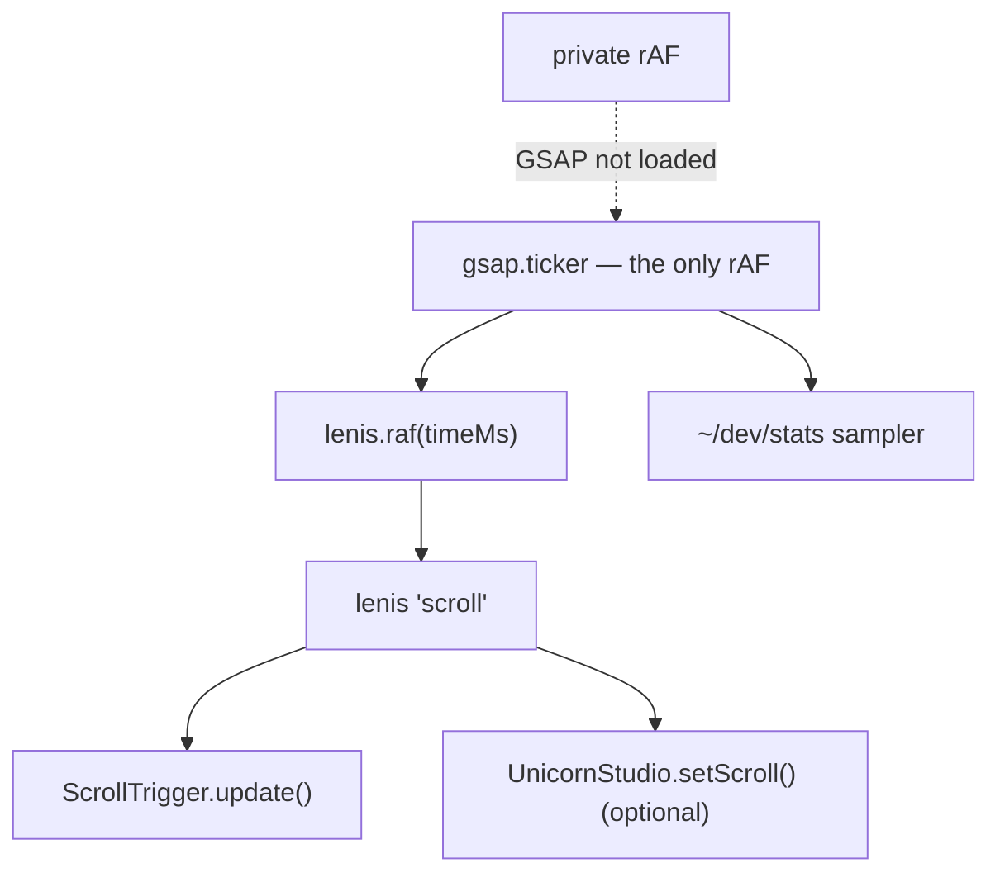

# Motion

Opt-in animation for the starter: GSAP for the animation itself, Lenis for
smooth scroll, and one shared animation loop underneath both.

| Module | What it is | Docs |
|---|---|---|
| `gsap/` | GSAP with scoped setup and automatic cleanup | [README](./gsap/README.md) |
| `lenis/` | Smooth scroll, wired to ScrollTrigger | [README](./lenis/README.md) |
| `ticker.ts` | The single `requestAnimationFrame` loop | below |

Nothing here ships until you import it, and nothing in `app.tsx` references it.
Both libraries are dynamically imported on mount, so they stay out of the initial
bundle and never evaluate during SSR.

```tsx
import { createGsap } from "~/integrations/motion/gsap"
import { SmoothScroll } from "~/integrations/motion/lenis"
```

Import from the sub-modules rather than the `~/integrations/motion` barrel when you only need
one of them — the barrel pulls both module graphs into scope.

## The single loop

Two `requestAnimationFrame` loops fighting each other is the most common cause
of janky scroll sites, and it is an architectural problem: it cannot be fixed by
optimising assets. So nothing in this starter opens its own loop. Lenis and the
performance sampler in `~/dev/stats` both subscribe to `ticker.ts`, which keeps
exactly one.



When GSAP loads it becomes the master clock: `loadGsap` calls
`setTickerSource(gsap.ticker)` and every existing subscriber migrates onto GSAP's
loop mid-flight. Without GSAP the fallback drives them, so each module still
works on its own.

```ts
import { addTick } from "~/integrations/motion"

// Times are milliseconds on both backends.
const off = addTick((timeMs, deltaMs) => { ... })
onCleanup(off)
```

The loop stops entirely when the last subscriber leaves, and never starts on the
server.

## Reduced motion

Both modules default to respecting `prefers-reduced-motion: reduce` and both let
you opt out per animation:

- `createGsap` skips its callback (`respectReducedMotion: false` to override).
- Lenis is never even downloaded (`skipOnReducedMotion: false` to override).
- `createGsapMatchMedia` is the escape hatch when an animation carries meaning
  and needs a reduced variant rather than no animation.

`~/styles`'s `createReveal` is the third option, and often the right one: a
CSS-only reveal on `transform`/`opacity` that runs on the compositor and needs no
JavaScript animation library at all. Reach for GSAP when you need sequencing,
scrubbing, pinning, or splitting.

## Testing

```sh
bun test --conditions browser src/integrations/motion
```

The condition matters: without it Bun resolves Solid's server build, where
`onMount` is a no-op and none of these primitives run. The root `test` script
already passes it.

Every loader has a `set*Loader` hook so tests never evaluate the real library —
`setGsapLoader`, `setGsapPluginLoader`, `setLenisLoader`.
