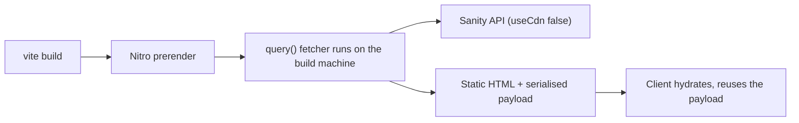

# Sanity

[Sanity](https://sanity.io) content, resolved at build time into static HTML.

The Studio lives in [`../../../studio`](../../../studio) as its own workspace, so no
React reaches this bundle. This module is the read side only.

## Setup

```sh
cp .env.example .env   # then fill in VITE_SANITY_PROJECT_ID
```

Then set the Studio up too (see its README) and generate types:

```sh
bun run sanity:typegen
```

Nothing imports this module by default, so the site builds and runs with Sanity
unconfigured. The first import without a project id throws with a pointer to
`.env.example` — deliberately at build time, rather than prerendering pages with
silently missing content.

## Usage

```tsx
import { createAsync } from "@solidjs/router"
import { getPost, PortableText, SanityImage } from "~/integrations/sanity"

export default function Post(props: RouteSectionProps) {
  const post = createAsync(() => getPost({ slug: props.params.slug }))

  return (
    <Show when={post()}>
      {(entry) => (
        <article>
          <h1>{entry().title}</h1>
          <Show when={entry().coverImage}>
            {(image) => (
              <SanityImage
                source={image().source}
                alt={image().alt ?? ""}
                width={image().width}
                height={image().height}
                lqip={image().lqip}
                sizes="(min-width: 64rem) 50vw, 100vw"
                priority
              />
            )}
          </Show>
          <PortableText value={entry().body} />
        </article>
      )}
    </Show>
  )
}
```

## How this works with a static build



Each query is wrapped in Solid Router's `query()`. During prerender the fetcher
runs on the build machine and its result is serialised into the page under a cache
key made from the query name and its arguments. On hydration the router finds that
value and reuses it rather than calling the fetcher again — so **a prerendered
page shows CMS content with no client-side request at all**.

Three consequences worth knowing before you build on this:

**Publishing does not update the site.** Content is frozen at build time. Point a
Sanity webhook at your host's build hook (Netlify, Vercel, Cloudflare Pages all
have one) so publishing triggers a rebuild.

**Dynamic routes have to be discoverable.** `crawlLinks: true` in
`vite.config.ts` starts at `/` and follows links in the rendered HTML, so a
listing page that links to every post is what makes those posts prerender. A
route nobody links to needs an explicit entry:

```ts
nitro({
  preset: "static",
  prerender: {
    crawlLinks: true,
    routes: ["/work/an-unlinked-case-study"],
  },
})
```

`PAGE_SLUGS_QUERY` and `POST_SLUGS_QUERY` are exported for generating that list
if you ever need it.

**No `"use server"`, anywhere.** The `static` preset produces no server runtime,
so a server function would compile to an endpoint that does not exist. Fetching
here is plain isomorphic code that happens to run during prerender.

### The one time a visitor's browser talks to Sanity

A client-side navigation to a route whose data was not on the page they landed on
runs the fetcher in the browser. It hits Sanity's CDN, which is fast and cached,
but it does mean the dataset must be readable without a token.

If you want that to never happen, `setSanityFetcher` replaces the fetcher for
every query — point it at a snapshot committed to the repo, or at a JSON file
emitted next to the static output:

```ts
import { setSanityFetcher } from "~/integrations/sanity"

setSanityFetcher(async (query, params) => readFromSnapshot(query, params))
```

## Client configuration

Set in `client.ts`, with reasons:

| Setting | Value | Why |
|---|---|---|
| `useCdn` | `!import.meta.env.SSR` | Uncached at build time, so a build ships what was just published. CDN in the browser, where latency matters more |
| `perspective` | `"published"` | Drafts must never reach a static build. Explicit, because the default has changed between client majors |
| `stega` | `false` | Content Source Maps need a live server for visual editing |
| `apiVersion` | pinned date | An API change cannot alter a build that used to work |

`VITE_`-prefixed env vars are inlined into the client bundle, so the project id
and dataset are public. That is fine — they are not credentials.

`SANITY_READ_TOKEN` is the exception, for a private dataset. It is read from
`process.env` behind an `isServer` guard, which Solid compiles to `false` in the
client bundle, so the branch is eliminated and the token cannot be inlined. Note
that a token makes every read authenticated and therefore uncached; leave it unset
for a public dataset, which is the right default here.

## Images

`<SanityImage />` builds a `srcset` from Sanity's image pipeline. Two defaults
exist to protect metrics:

- **CLS.** `width` and `height` come from the query projection
  (`asset->metadata.dimensions`) and are passed through, so the browser reserves
  the right box before the bytes arrive. This is why the fragments in `queries.ts`
  always ask for them, and why `sanity.test.ts` fails if one stops.
- **LCP.** Everything is `loading="lazy"` and `decoding="async"` unless marked
  `priority`, so below-the-fold images cannot compete with the one that matters.
  Use `priority` on the LCP element and nothing else.

`auto("format")` does the format work: the CDN negotiates AVIF or WebP from the
request's `Accept` header, which beats pinning a format and generating variants.
Editor hotspots and crops are respected automatically.

Always pass `sizes`. Without it the browser assumes `100vw` and picks a candidate
far larger than it needs.

`urlFor`, `srcSet` and `src` are exported for cases the component does not cover —
`urlFor(source).width(1200).height(630).url()` for an OG image, for instance.

## Portable Text

`<PortableText />` renders through `@portabletext/to-html`, which produces an HTML
string set via `innerHTML`. On a static build that string is produced once, on the
build machine, and the client does no rendering work: no per-node components, no
reconciliation. A Solid component tree per block type would cost bundle size and
hydration time for output that cannot change after the build.

Override one serialiser without losing the rest:

```tsx
<PortableText
  value={post.body}
  components={{ block: { h2: ({ children }) => `<h2 class="text-2xl">${children}</h2>` } }}
/>
```

Every style, list and mark in the Studio's `blockContent` needs a serialiser or it
falls back to a plain paragraph. Keep the two in step.

`toPlainText(blocks)` flattens to text, for meta descriptions and excerpts.

## Types

Nothing here describes content by hand. `./sanity.types.ts` is generated by
`bun run sanity:typegen` from the real schema and the GROQ in `queries.ts`, and
`./types.ts` only gives its `*_QUERY_RESULT` types friendlier names (`Post`,
`PostSummary`, `Page`, `SiteSettings`). Change a projection or a schema field and
these follow — or stop compiling, which is the point. Both files are committed, so
a fresh checkout typechecks without Studio credentials.

The generated types are nullable nearly everywhere, including fields the schema
marks `required()`. That is deliberate: validation runs in the Studio at publish
time, but a document written through the API can skip it, so the type describes
what may actually arrive. `studio/scripts/extract-schema.ts` can pass
`enforceRequiredFields` if you would rather have fewer null checks than that
guarantee.

Because `overloadClientMethods` is on in the Studio's `sanity.cli.ts`,
`getSanityClient().fetch(POST_QUERY)` is typed from the query itself with no
annotation, as long as the query was written with `defineQuery`. All of them are.

## Files

| File | Responsibility |
|---|---|
| `env.ts` | Configuration, and the token guard |
| `client.ts` | The configured client |
| `fetch.ts` | GROQ to result, plus `setSanityFetcher`. No router |
| `query.ts` | The Solid Router `query()` wrapper |
| `queries.ts` | The GROQ itself. No router, no client |
| `loaders.ts` | The cached queries you actually call |
| `image.ts` / `sanity-image.tsx` | URL building and the `` |
| `portable-text.tsx` | Rich text |

The split between `queries.ts`, `fetch.ts` and `query.ts` is deliberate: the GROQ
and the fetching can be imported from a build script or a test without pulling the
router — which touches `window` at import time — in with them.

## Notes

- Visual editing, draft mode and Presentation are out of scope. All three need a
  live server to render drafts per request, and this site has none.
- This module does not mount itself. Nothing in `app.tsx` references it.
